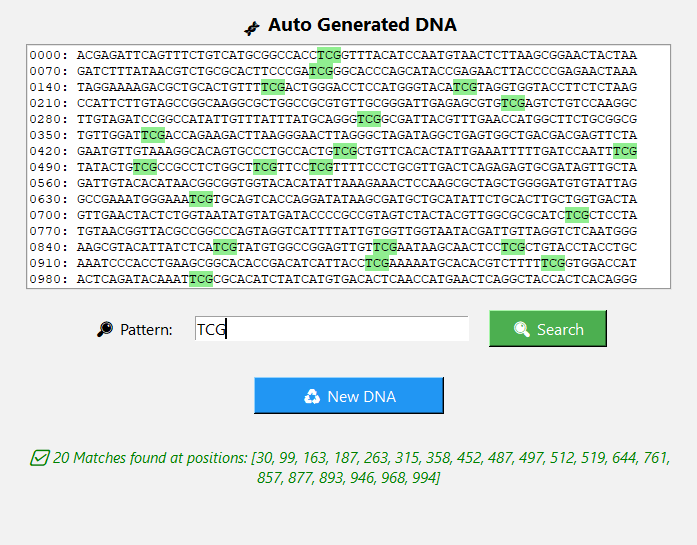

# 🧬 DNA Pattern Matcher - Boyer-Moore Algorithm

This is a desktop application with a graphical user interface (GUI) built in Python that allows you to **search for patterns within DNA sequences** using the **Boyer-Moore algorithm**.

---

## 💡 Motivation

This project was born out of my studies of the **Boyer-Moore algorithm**, well-known for its efficiency in pattern matching across large strings of text.

While studying it, I realized that a powerful way to solidify my understanding would be to apply the algorithm in a practical context — and that’s how this application came to life.

Instead of just running static examples in the terminal, I decided to build an interactive interface where I could:
- Visualize how the algorithm works in real-time
- Generate different test scenarios with random DNA sequences
- Observe how Boyer-Moore optimizes its pattern shifts

More than just a programming exercise, this app became a learning and visualization tool — combining theory, hands-on experimentation, and a touch of design.

---

## 🚀 Features

- Randomly generates a DNA sequence with 1000 bases
- Customizable pattern input (e.g., `ATG`, `TGA`, `CGT`)
- Efficient pattern search using the **Boyer-Moore** algorithm
- Visual highlighting of all matching patterns within the DNA
- Column-formatted DNA with line numbers for easier reading
- Dynamic result messages with match count and positions
- Button to regenerate a new DNA sequence at any time

---

## 🖼️ Demo

> Example using pattern `TGC`:



---

## 📦 Requirements

- Python 3.10+
- No external libraries needed (uses built-in `tkinter` for the GUI)

---

## ▶️ How to Run

Clone the repository and run the `app.py` file:

```bash
git clone https://github.com/your-username/dna-pattern-matcher.git
cd dna-pattern-matcher
python app.py
```

## ✨ To-do (future improvements)

- [ ] Export results to `.txt` file
- [ ] Add support for FASTA or real DNA sequence files
- [ ] Package the app as a standalone `.exe` for easy distribution

## 📄 License

This project is licensed under the [MIT License](LICENSE).
